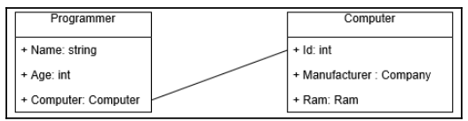
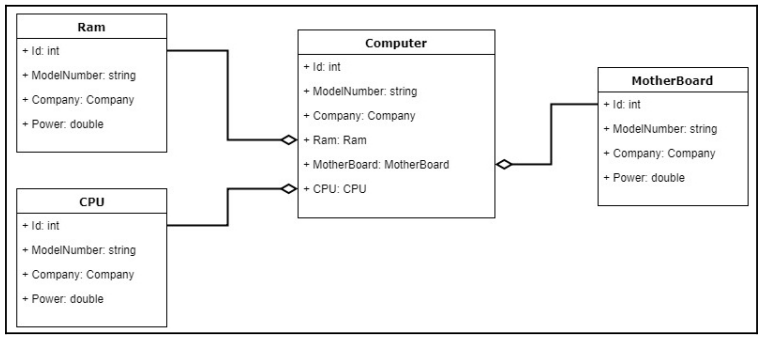
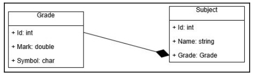
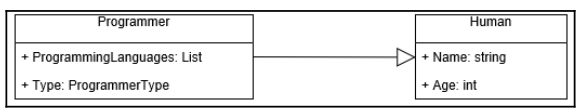

# Chapter 3 - Object Collaboration
## Description

As we saw in earlier chapters, OOP is all about objects, which are the main focus of this
programming methodology. When we design our software using this methodology, we
will keep the concepts of OOP in mind. We will also try to break our software components
into smaller objects and create proper relationships between the objects so that all of them
can work together to give us our desired output.

## 1. Different types of object collaboration in C#

Now, let's look at the three collaboration types that we are going to be talking about in this
chapter, as shown in the following list:

**1. Dependency**

**2. Association**

**3. Inheritance**

**Case Study**

For our example, we are going to develop some restaurant management software. This
could be for a luxury restaurant, or a small cafe where people come to drink coffee and
relax. In our case, we are thinking of a restaurant with mid-range pricing. To begin building
this application, let's think about what classes and objects we need. We will be needing a
Food class, a Chef class, a Waiter class, and maybe a Beverage class.

### 1.1 Dependency
When an object uses another unrelated object to carry out a task, the relationship between them is called a **dependency**.

```C#
    // Food class
    public class Food                          
    {
        public int? FoodID { get; set; }
        public string Name { get; set; }
        public decimal Price { get; set; }
    }

    // Interface for Food's database action
    public interface IFoodDatabase
    {
        int SaveFoodToDatabase(Food food);
        int GetFoodFromDatabase(int foodId);
    }

    // Implementation of Food Database's action
    public class SQLFoodDatabase : IFoodDatabase
    {
        public int SaveFoodToDatabase(Food food)
        {
            //Implementation
            return 0;
        }

        public int GetFoodFromDatabase(int FoodId)
        {
            //Implementation
            return 0;
        }
    }

    //Food Repository for pushing and retrieving food data
    public class FoodRepository 
    {
        private SQLFoodDatabase _foodDatabase;
        public FoodRepository(SQLFoodDatabase database)
        {
            _foodDatabase = database;
        }

        public int SaveFood(Food food)
        {
            int result = _foodDatabase.SaveFoodToDatabase(food);
            return result;
        }

        public int GetFood(int foodId)
        {
            int result = _foodDatabase.GetFoodFromDatabase(foodId);
            return result;
        }
    }
```

Another extensive example of the above code are as follows:

```C#
    public class Item
    {
        public int? ItemID { get; set; }
        public string Name { get; set; }
        public decimal Price { get; set; }
    }
    public class Food : Item
    {
        public Food(int? FoodId, string FoodName, decimal FoodPrice)
        {
            ItemID = FoodId;
            Name = FoodName;   
            Price = FoodPrice;
        }

        public void GetFullDescription()
        {
            string Description = $"This Food has an ID of {ItemID}, the name of this food is {Name}, its price is {Price}";
            Console.WriteLine(Description);
        }
    }

    public class Beverage : Item
    {
        public Beverage(int? BeverageId, string BeverageName, decimal BeveragePrice)
        {
            ItemID = BeverageId;
            Name = BeverageName;
            Price = BeveragePrice;
        }

        public void GetFullDescription()
        {
            string Description = $"This drink has an ID of {ItemID}, the name of this drink is {Name}, its price is {Price}";
            Console.WriteLine(Description);
        }

    }

    public interface IItemDatabase
    {
        int SaveItemToDatabase(Item item);
        int GetItemFromDatabase(int foodId);
    }

    public class SQLFoodDatabase : IItemDatabase
    {
        public int SaveItemToDatabase(Item item)
        {
            //Implementation
            return 0;
        }

        public int GetItemFromDatabase(int itemId)
        {
            //Implementation
            return 0;
        }
    }

    public class FoodRepository 
    {
        private SQLFoodDatabase _foodDatabase;
        public FoodRepository(SQLFoodDatabase database)
        {
            _foodDatabase = database;
        }

        public int SaveFood(Food food)
        {
            int result = _foodDatabase.SaveItemToDatabase(food);
            return result;
        }

        public int GetFood(int foodId)
        {
            int result = _foodDatabase.GetItemFromDatabase(foodId);
            return result;
        }
    }

    public class BeverageRepository
    {
        private SQLFoodDatabase _beverageDatabase;
        public BeverageRepository(SQLFoodDatabase database)
        {
            _beverageDatabase = database;
        }

        public int SaveFood(Beverage beverage)
        {
            int result = _beverageDatabase.SaveItemToDatabase(beverage);
            return result;
        }

        public int GetFood(int beverageID)
        {
            int result = _beverageDatabase.GetItemFromDatabase(beverageID);
            return result;
        }
    }

    public class Program
    {
        static void Main(string[] args)
        {
            Food BanhMi = new Food(11, "Banh Mi", 5000);
            Beverage CocaCola = new Beverage(12, "Coca Cola", 2000);

            BanhMi.GetFullDescription();
            CocaCola.GetFullDescription();
            Console.ReadLine();
        }
    }
```

In the above example `FoodRepository` and `BeverageRepository` use `Food` and `Beverage` item. This means that they have a dependency with their according object.

Another example can be the relationship between `Programmer` and `Computer`. They would have a `dependency` relationship as `Programmer` *uses* `Computer`.

In, **Unified Modeling Language** (UML) diagram, the dependency relationship is represented using a solid line.



## 1.2 Association

Another type of relationship is the association relationship. This type of relationship is
unlike the dependency relationship. In this type of relationship, one object knows another
object and is associated with it. This relationship is achieved by having one object as a
property of another object. In the software community, this relationship type is also
referred to as a has a relationship. THis association can be divided into the following categories:

**1. Aggregation**

**2. Composition**

### 1.2.1 Aggregation
When one object has another object in it as a property and this other object is independent,
this is called an aggregation relationship.

``` C#
public class Car{
    public Engine Engine1 {get; set;}
    // Other properties ad methods
}
```

Now the question is, what is this type of relationship? The deciding factor is that an engine
is a separate object that functions independently of a car. When the manufacturer creates an
engine, they don't make it when they are creating the other parts of the car: they can create
it separately. Even without a car, an engine can be tested or even used for another purpose.
Consequently, we can say that the type of relationship that the car has with the engine is
an aggregation relationship.

This can be further illustrated using the above examples:

```C#
public class Food : Item{
    public Chef Chef {get; set;}
}

public class Beverage : Item{
    public manufacturer manufacturer {get; set;}
}
```

If we think about it, `beverage` and `food` can not exist without its makers (chef and manufacturer). Therefore, we say that `beverage` and `food` *has* `manufacturer` and `chef` respectively. Furthermore, as `manufacturer` and `chef` are independent identity with regards to `beverage` and `food`. We say that there relationship is **aggregation relationship**.

One last example to finalize this point, the relationship between `computer` and `ram`, `CPU`, `Motherboard`, would also be aggregation as `computer` *has* these entities.

```C#
public class Computer{
    public int ID {get; set;}
    public string Model {get; set;}
    public decimal Price {get; set;}
    public Ram Ram {get; set;}
    public CPU CPU {get; set;}
    public Motherboard Motherboard {get; set;}
}

public class Ram{
    // Ram properties
}

public class CPU{
    // CPU properties
}

public class Motherboard{
    // Motherboard properties
}
```

The representation of **aggregation relationship** is a solid line and a diamond, the diamon is placed at the side of the class that holds the properties.



### 1.2.2 Composition
A composition relationship is a type of association relationship. This means that one object
will have another object as its property, but where it differs from aggregation is that, in
composition, the object that is used as a property can't exist independently; it must have the
help of another object in order to be functional.

`chef` and `manufacturer` can independently exist without `food` and `beverage`. However, if we think about the relationship between `Order` and `OrderItem`, we can see that `OderItem` has no meaning without `Order`.

``` C#
public class Order{
    public int OrderedID {get; set;}
    public List<OrderItem> OrderItems {get; set;}
    public DateTime OrderTime {get; set;}
    public Customer Customer {get; set;}
}
```

Another example would be the relationship between `Subjet` and `Grade`.

``` C#
public class Subject{
    public int SubjectID {get; set;}
    public string Name {get; set;}
    public Grade Grade {get; set;}
}

public class Grade{
    public int GradeID {get; set;}
    public double Mark {get; set;}
    public char GradeSymbol {get; set;}
}
```
The representation of **Composition relationship** is a solid line and a black diamond, the diamond is placed at the side of the class that holds the property.



## 1.3 Inheritance

se
class and the class that inherits the base class is normally called the derived class. The
inheritance relationship can be treated as an is a relationship. For example, pasta is a Food.
The Pasta object has a unique ID in the database, which has other properties such as name,
price, and chef. So, as Pasta satisfies all the attributes of the Food class, it can inherit
the Food class and use the properties of the Food class. Let's look at the code:

```C#
public class Pasta : Food{
    public string Type {get; set;}
    public Sauce sauce {get; set;}
    public string [] Spices {get; set;}
}
```
In the example about `programmer`, we can confortably said that `programmer` *inherit* `human`.

```C#
public class Programmer : Human{
    public List<ProgrammingLanguage> ProgrammingLanguages {get; set;}
    public ProgrammerType {get; set;}

    public bool WorkOnAProject (Project project, Computer computer){
    
    }
}
```
The representation of **inheritance relationship** is a solid line with a white triangle attached to it. The triangle points in the direction of the superclass.

