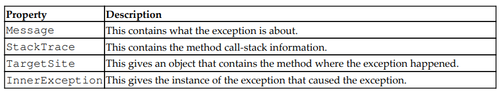
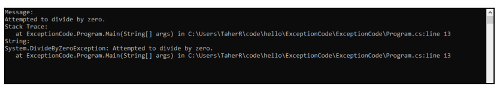
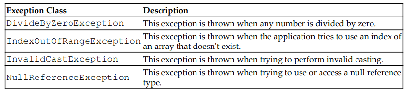

# Chapter 4 - Exception Handling
## Description

**Exception handling** means handling/controlling/supervising exceptions that occur while
we are running the program

## 1. Basics of exception handling

Exception handling in C# is mainly achieved by four keywords: *try*, *catch*, *throw* ,and *finally*.

**- try**: The try
block will throw an exception if any exception happens inside the code for that
block. If no exception occurs, the try block will act like a normal code block. The
try block is actually designed to throw exceptions, which is its main task.

**- catch**: Exceptions
thrown by the try block will be handled by the following catch block. There
could be multiple catch blocks for a try block. Each catch block can be
dedicated to a particular exception. Consequently, we should write different
catch blocks for different types of exception.

**- throw**: This is used when you manually want to throw an exception. There could
be situations in which you want to do this to control a specific kind of situation.

**- finally**: It doesn't
matter whether the try block threw an exception or not—the finally block will
be executed. This is mainly used to code some tasks that are essential to handle in
any case.

## 2. Try and catch
The *try* and *catch* keywords are the two most important keywords for exception handling
in C#. If you write a *try* block without a *catch* block, then it won't make any sense
because, if a *try* block throws an exception and there is no *catch* block to handle it, then
what is the benefit? The exception will still be unhandled. The *catch* block actually
depends on a *try* block. A *catch* block can't exist if there is no try block associated with
it

``` C#
 public class Program
    {
        static void Main(string[] args)
        {
            int a, b, result;

            while (true)
            {
                Console.Write("Enter a value for a: ");
                if (!int.TryParse(Console.ReadLine(), out a))
                {
                    Console.WriteLine("Error: Invalid input for a.");
                    continue;
                }

                Console.Write("Enter a value for b: ");
                if (!int.TryParse(Console.ReadLine(), out b))
                {
                    Console.WriteLine("Error: Invalid input for b.");
                    continue;
                }

                try
                {
                    result = a / b;
                    Console.WriteLine("Result: " + result);
                    break;
                }
                catch (DivideByZeroException)
                {
                    Console.WriteLine("Error: Division by zero.");
                }
            }

            Console.ReadLine();

        }
    }
```

## 3. What happens if we dont handle exceptions

When the system runtime faces an exception, it just terminates the program.
So, now you understand why you should handle exceptions. If you fail to do this, your
application might break down in the middle of running. I am sure you personally don't like
programs that crash while you are using them, so we have to be careful about writing
exception-free software

``` C#
Using System;

class LearnException{
    public static void Main(){
        int [] a = {1,2,3,4};
        for(int i = 0; i < 10; i++){
            Console.WriteLine(a[i]);
        }
    }
}

```

If we run this code, then the first four times that it is run, it will perform perfectly and print
some numbers from one to four. But after that, it will throw an exception of
*IndexOutOfRangeException* and the system runtime will terminate the program.

``` C#
using System;
class ManyCatchBlocks{
    public static void Main(){
        try{
            var a = 5;
            var b = 0;
            Console.WriteLine("Dividing 5 with 0");
            var c = a / b;
        }
        catch (IndexOutOfRangeException ex){
            Console.WriteLine("Index is out of range " + ex);
        }
        catch (DivideByZeroException){
            Console.WriteLine("You have divided by zero");
        }
    }
}
```

In the above example only the second *catch* block will be executed.

*try*, *catch* ,and *finally* are particularly useful when dealing with database, as *try* and *catch* can detect and deal with any exception and *finally* can close the connection to the database in case exception occurs.

``` C#
using System;
class finallyUsage{
    public static void Main(string[] args){
        try{
            //Step 1 Open connection to database
            //Perform some activities
        }
        catch(IndexOutOfRangeException ex){
            //Hdanle IndexOutOfRangeException
        }
        catch (DivideByZeroException ex){
            //Handle DivideByZeroException
        }
        catch{
            //Handle all other exception
        }
        finally{
            //close the database connection
        }
    }
}
```

## 4. Exception class
An `exception` is simply a class in C#. This has a few properties and methods. The four most commonly used properties are as follows:




``` C# 
using System;
namespace ExceptionCode{
    class Program{
        static void Main(string [] args){
            try{
                var a = 5;
                vat b = 0;
                var c = a / b;
            }
            catch (DivideByZeroException ex){
                Console.WriteLine("Message: ");
                Console.WriteLine(ex.Message);
                Console.WriteLine("Stack Trace:");
                Console.WriteLine(ex.StackTrace);
                Console.WriteLine("String:");
                Console.WriteLine(ex.ToString());
            }
            Console.ReadKey();
        }
    }
}
```

The output is as follows:



## 5. Some common exception classes
There are many exception classes available in .NET Framework. The .NET Framework team
created these to make the developer's life easier. The .NET Framework provides specific
information about the exceptions.



## 6. User-defined exception
Sometimes, you'll encounter a situation where you might think that the predefined
exceptions do not satisfy your condition. In this instance, you might wish there was a way
to create your own exception classes and use them.

## 7. Exception handling best practices

**1. Use a finally block to close/clean up dependent resources that could cause a
problem in the future.**

**2. Catch the specific exception and handle it properly. Use multiple catch blocks if
needed.**

**3. Create your own exceptions if needed and use them.**

**4. Handle exceptions as soon as possible.**

**5. Don't use a general exception handler if you can handle an exception using a
specific handler.**

**6. The exception messages should be very clear.**
