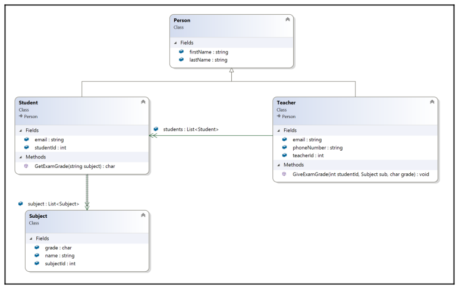
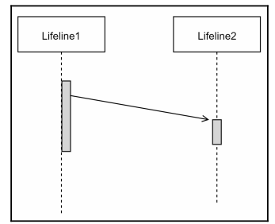

# 8. Modeling and Designing Software
## Description

Software modeling and design are important parts of the software development life cycle. If
you have an idea and you are planning to start a software project, the first thing you should
do is design and model the software, not just jump into writing the code
## Class Diagrams

A class diagram is a structural diagram that is mainly used to provide the design of a piece of object-oriented software. This diagram demonstrates the structure of a software, the
attributes and methods of a class, and the relationship between classes in the system.

The following are the three main parts of a class diagram:

**1. The class name**

**2. The attribute section**

**3. The method section**

The representation of different object relationship using class diagrams is also important.

## 8.1 Inheritance

Inheritance is a relationship in which one class is like another class, in the same way that a
BMW i8 Roadster is a kind of car. This type of relationship is shown using a line and a
hollow arrow. The arrow points from the class to the super class, as shown in the following
diagram:

## 8.2 Association

An association relationship is the most basic relationship between objects. When one object
has some kind of logic or physical relationship with another object it is called association
relationship. It is represented by a line and an arrow. If there is an arrow on both sides, this
represents a bidirectional relationship. An example of an association could be the following:

## 8.2.1 Aggregation

An aggregation relationship is a special type of association relationship. This relationship
is usually known as a has-a relationship. When one class has another class/object in it, this
is an aggregation relationship. This is represented using a line and a hollow diamond. For
example, a car has a tire. A tire and a car have an aggregation relationship, as shown in the
following diagram:

## 8.2.2 Composition

When one class has another class in it and the dependent class can't exist without the super
class, this is a composition relationship. For example, a bank account can't exist without a
bank, as shown in the following diagram:

## 8.3 Dependency

When a class has a dependent class, but the class itself is not dependent on its own
dependent class, the relationship between those classes is called a dependency
relationship. In a dependency relationship, any change in the dependent class doesn't have
any effect on the class it is dependent on. But the dependent class will be affected if the
class that it is dependent on changes:

## 8.4 Example of a class diagram

## 8.5 Sequence diagram

A sequence diagram is an interaction diagram that falls under the category of
behavioral diagrams. As the name suggests, it shows the sequence of the activities of a
system. By looking at a sequence diagram, you can identify which activities happen during
a particular time frame and which activities come next.

## 8.5.1 An activation

An activation is a small rectangular box on a lifeline. This activation box represents the
point when an activity was active. The top of the box represents the start of the activity and
the end of the box represents the end of the activity.

## 8.5.2 A call message

A call message indicates an interaction between lifelines. It flows from left to right and is
denoted by an arrow at the end of a line, as shown in the following diagram. A message call
represents some kind of information or a trigger to the next lifeline:

## 8.5.3 A return message

The normal message flow in a sequence diagram is from left to right, as this represents the
action commands; however, sometimes messages are returned to the caller. A return
message flows from right to left and is denoted by a dotted line with an arrow head at the
end, as shown in the following diagram:

## 8.5.4 A self message

Sometimes, messages are passed from a lifeline to itself, such as an internal communication.
It will be denoted in a similar way to a message call, but instead of pointing to another
activity of another lifeline, it returns to the same activity of the same lifeline, as shown in
the following diagram:

## 8.5.5 A recursive message

When a self message is sent for recursive purposes, it is called a recursive message. Another
small activity on the same timeline is drawn for this purpose, as shown in the following
diagram:

## 8.5.6 A create message

This type of message is not a normal message, such as a call message. A create message is
used when a lifeline is created by another lifeline, as shown in the following diagram:

## 8.5.7 A destroy message

When a destroy message is sent from an activity to a lifeline, it means that the following
lifeline is not going to be executed and the flow will be stopped, as shown in the following
diagram. It is called a destroy message because it destroys the activity flow:

## 8.5.8 A duration message

We use a duration message to show when there is a time duration between when an
activity passes a message to the next activity and when the next activity receives it. It is
similar to a call message, but is angled down, as shown in the following diagram:

## 8.5.9 An example of a sequence diagram

