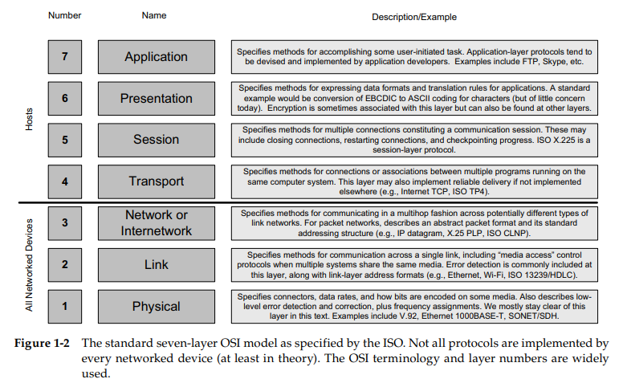
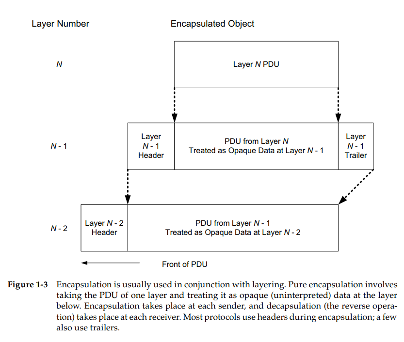

# TCP/IP 

## **1.1 Architectural Principles**

The TCP/IP protocol suite allows computers, smartphones, and embedded devices 
of all sizes, supplied from many different computer vendors and running totally 
different software, to communicate with each other. 

## **1.2 Design and Implementation**

### 1.2.1 Layering

With layering, each layer is responsible for a different facet of the communications. Layers are beneficial because a layered design allows developers to evolve 
different portions of the system separately, often by different people with somewhat different areas of expertise. 

### 1.2.2 Multiplexing, Demultiplexing, and Encapsulation in Layered Implementations

One of the major benefits of a layered architecture is its natural ability to perform 
**protocol multiplexing**. This form of multiplexing allows multiple different protocols 
to coexist on the same infrastructure. It also allows multiple instantiations of the 
same protocol object (e.g., connections) to be used simultaneously without being 
confused.

Multiplexing can occur at different layers, and at each layer a different sort of 
identifier is used for determining which protocol or stream of information belongs 
together.

Thus, multiple objects at layer N can be multiplexed together using 
encapsulation in layer N - 1. Figure 1-3 shows how this works. The identifier at 
layer N - 1 is used to determine the correct receiving protocol or program at layer 
N during demultiplexing.

Most commonly a layer prepends the PDU with its own header, 
although trailers are used by some protocols (not TCP/IP). The header is used for 
multiplexing data when sending, and for the receiver to perform demultiplexing, based on a demultiplexing (demux) identifier.

Figure 1-4 
shows that in some cases a device needs to implement only a few layers if it is 
expected to perform only certain types of processing.

