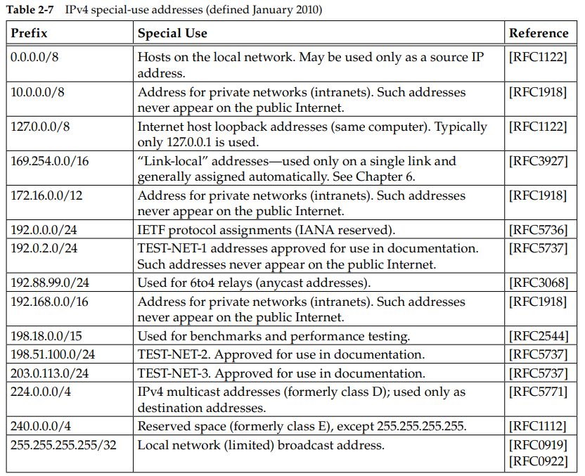
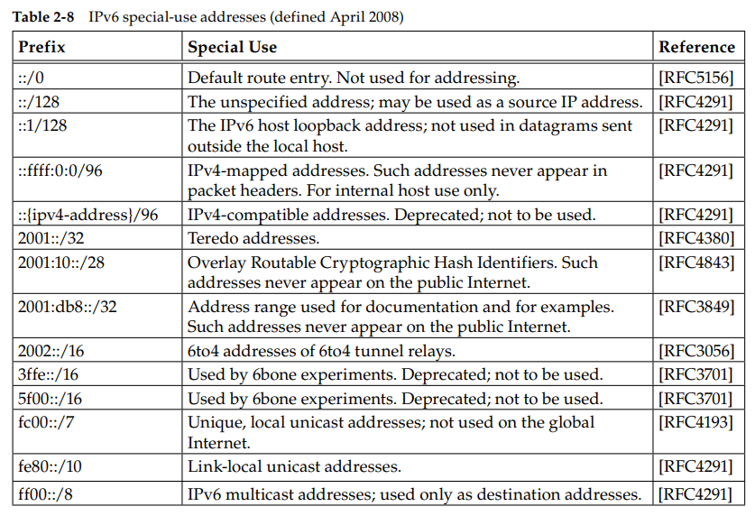
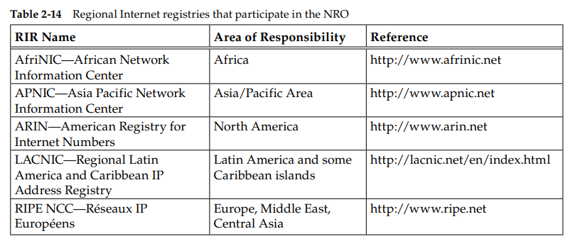

# 2. The Internet Address Architecture

## 2.1 Introduction
When devices are attached to the global Internet, they are assigned addresses 
that must be coordinated so as to not duplicate other addresses in use on the network. For private networks, the IP addresses being used must be coordinated to 
avoid similar overlaps within the private networks.

## 2.2 Expressing IP Addresses

### IPv4

IPv4 addresses have 32 bit representation and are often represented in so-called dotted-quad or dotted-decimal notation, for example, 165.195.130.107.


### IPv6

In IPv6, address are 128 bits in length, four times larger than IPv4 addresses. 
The conventional notation adopted for IPv6 address is a series of four hexadecimal called block or fields separated by a colon, for example, 5f05:2000:80ad:5800:0058:0800:2023:1d71.

According to **RFC4291** and **RFC5952**, IPv6 representation has to follow the following rule:

**1.** Leading zeros must be suppressed (e.g., 2001:0db8::0022 becomes 2001:db8::22).

**2.** The :: construct must be used to its maximum possible effect (most zeros suppressed). If multiple blocks contain equal-length runs of zeros, the first is replaced with ::.

**3.** The hexadecimal digits a to f should be represented in lowercase.

**4.** Embedded IPv4 addresses represented in the IPv6 format can use a form of hybrid notation in which the block immediately preceding the IPv4 portion of the address has the value ffff and the remaining part of the address is formatted using dotted-quad. For example, the IPv6 address ::ffff:10.0.0.1 represents the IPv4 address 10.0.0.1.

In some circumstances, bracket characters are used to differentiate IPv6 address with the other parts of the URL.

```
http : // [2001 : : 85a3 : 1319: 8a2e: 0370 : 73441 : 443/
```
refers to port number 443 on IPv6 host 2001:0db8:85a3:08d3:1319:8a2e:0370:7344 
using the HTTP/TCP/IPv6 protocols.

## 2.4 CIDR and Aggregation

In the early 1990s, three particular issues were considered so important as to require immediate attention:

**1.** By 1994, over half of all cals B addresses had already been allocated.

**2.** The 32-bit IPv4 address was thought to be inadequte to handle the size of the Internet by the early 2000s.

**3.** The number of entries in the global routing table was growing to the point that routing performance would suffer.

### 2.4.1 Prefixes

Prefix allows network administrators to divide a single IPv4 network into multiple smaller sub-network, reducing the number of IP addresses required for each network.

Prefixes work by using a portion of the IP address to identify the network and a portion to identify the device within the network. The network portion is determined by the subnet mask, which is a 32-bit value that specifies which bits of the IP address are used to identify the network.

For example, if the subnet mask is 255.255.255.0, the first 24 bits of the IP address are used to identify the network, and the last 8 bits are used to identify the device within the network. This allows for up to 2^24 (or 16,777,216) unique network addresses to be created using only a single class C address range.

### 2.4.2 Aggregation

Aggregation, also known as route summarization, is another technique that can help reduce the demand for IPv4 addresses by reducing the size of the routing tables in the Internet backbone.

Suppose an ISP has been assigned the following four IP address blocks:

* 192.168.0.0/24
* 192.168.1.0/24
* 192.168.2.0/24
* 192.168.3.0/24

Without aggregation, the ISP would need to advertise each of these blocks separately, which would result in four entries in the Internet routing tables.

To reduce the size of the routing tables, the ISP could aggregate these four blocks into a single, larger block. The prefix for this block would be 192.168.0.0/22, which covers all the addresses in the four smaller blocks.

## 2.5 Special-Use addresses

Both the IPv4 and IPv6 address spaces include a few address ranges that are used 
for special purposes (and are therefore not used in assigning unicast addresses). 





### 2.5.1 Multicast address and Broadcast address

Although Multicast and Broadcast address can be used for one to many communication, there are some key difference.

One key difference is that a broadcast message is sent to all devices on the network segment, regardless of whether they are interested in receiving the message or not. In contrast, a multicast message is only sent to devices that have explicitly joined the multicast group for that message.

Another difference is that broadcasts are generally limited to the local network segment, while multicast messages can be sent across multiple network segments and even across the Internet.

In IPv4, multicast addresses are in the range of 224.0.0.0 to 239.255.255.255.

In IPv6, multicast addresses use the range of ff00::/8. This means that the first 8 bits of a multicast IPv6 address are all set to 1, which distinguishes them from unicast and anycast addresses.

## 2.6 Allocation

IP address space is allocated, usually in large chunks, by a collection of hierarchically organized authorities. The authorities are generally organizations that allocate address space to various owners—usually ISPs or other smaller authorities. 

### 2.6.1 unicast

For unicast IPv4 and IPv6 address space, the IANA delegates much of its allocation 
authority to a few regional Internet registries (RIRs)



They allocate address space to smaller registries operating in countries 
(e.g., Australia and Singapore) and to large ISPs. ISPs, in turn, provide address 
space to their customers and themselves. When users sign up for Internet service, they are ordinarily provided a (typically small) fraction or range of their 
ISP’s address space in the form of an address prefix.


t is possible to use the Internet WHOIS service to determine how address space 
has been allocated. For example, we can form a query for information about the 
IPv4 address 72.1.140.203 by accessing the corresponding URL http://whois.arin.net/rest/ip/72.1.140.203.txt:

```
NetRange: 72.1.140.192 - 72.1.140.223
CIDR: 72.1.140.192/27
OriginAS: 
NetName: SPEK-SEA5-PART-1
NetHandle: NET-72-1-140-192-1
Parent: NET-72-1-128-0-1
NetType: Reassigned
RegDate: 2005-06-29
Updated: 2005-06-29
Ref: http://whois.arin.net/rest/net/NET-72-1-140-192-1
```

## 2.7 Attacks involving IP Addresses

Given that IP addresses are essentially numbers, few network attacks involve only 
them. Generally, attacks can be carried out when sending “spoofed” datagrams (see 
Chapter 5) or with other related activities.

This can also happen when compromised hosts 
are used to form botnets. Such collections of computers (and routers) can now be 
leased on what has effectively become an Internet-based black market for carrying 
out attacks, serving illicit content, and other misdeeds.