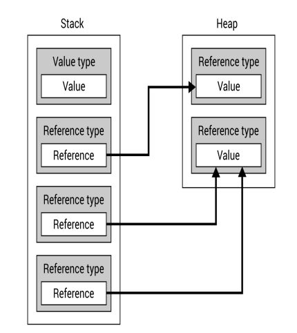

# Data Structures and Algorithm 
## Data types

While developing applications in the C# language, you could
use various data types, which are divided into two groups,
namely value types and reference types. The difference
between them is very simple—a variable of a value type
directly contains data, while a variable of a reference type just
stores a reference to data.



As you can see, a **Value type** stores its actual Value directly
in the **Stack memory**, while a **Reference type** only stores a
**Reference** here. The actual value is located in the **Heap
memory**. Therefore, it is also possible to have two or more
variables of a reference type that reference exactly the same
value.

### 1. Value types

Value types can be divided into **structs** and **enumerations**.

**Structs consists of many built-in types, which could be used as keywords**

**Enumerations has a set of named constant to specify the available set of values**

### 2. Reference types

A variable of a reference type does
not directly contain data, because it just stores a reference to
data. In this group, you can find three built-in types, namely
string, object, and dynamic. Moreover, you can declare classes,
interfaces, and delegates

## 3. Data Structure

### 3.1 Single-dimensional arrays

A single-dimensional array stores a collection of items of the
same type, which are accessible by an index. To use a single-dimensional array, you need to declare and
initialize it.

```C#
// Initialzation: type[] name;

int[] numbers;
```

```C#
// Declaration
numbers = new int[5];
```

```C#
// We can combine them
int[] numbers = new int[5];
```

```C# 
// We can specify the value using 
int[] numbers = new int[] {9,11, 6, -12, 1};
```

**Example - month names**

```C#
static void Main(string[] args)
        {
            string[] months = new string[12];
            for (int month = 1; month <= 12; month++)
            {
                DateTime firstday = new DateTime(DateTime.Now.Year, month, 1);
                string name = firstday.ToString("dd MMMM yyyy", CultureInfo.CreateSpecificCulture("en"));
                months[month - 1] = name;
            }
            foreach (string month in months)
            {
                Console.WriteLine($" -> {month}");
            }
        }
```

### 3.2 Multi-dimensional arrays

The arrays in the C# language do not need to have only one
dimension. It is also possible to create two-dimensional or
even three-dimensional arrays. To start with, let's take a look
at an example regarding the declaration and initialization of a
two-dimensional array with 5 rows and 2 columns:

```C#
int [,] numbers = new int[5,2];
```

```C#
// 3-dimensional arrays
int[, ,] numbers = new int[5,4,3];
```

```C#
        static void Main(string[] args)
        {
            //Init the 2-dimen array
            
            Console.Write("Enter Row and Col (separated by a space): ");
            string input = Console.ReadLine();
            string[] values = input.Split(' ');
            int row = int.Parse(values[0]);
            int col = int.Parse(values[1]);
            int[,] numbers = new int[row, col];

            //Enter value for the 2-dimen array
            for (int i = 0; i < row * col; i++)
            {
                int rowIndex = i / col;
                int colIndex = i % col;

                Console.Write($"Enter the value for element [{rowIndex},{colIndex}]: ");
                numbers[rowIndex, colIndex] = int.Parse(Console.ReadLine());
            }

            //Display values in the 2-dimen array
            int index = 0;
            foreach (int number in numbers)
            {
                Console.Write(number + ((index + 1) % col == 0 ? "\n" : " "));
                index++;
            }
        }
```


**Example 1 - multiplication table**

```C#
            //Init the Multiplication array
            Console.Write("Enter Row and Col (separated by a space): ");
            string input = Console.ReadLine();
            string[] values = input.Split(' ');
            int row = int.Parse(values[0]);
            int col = int.Parse(values[1]);
            int[,] results = new int[row, col];

            //Populate the array
            Console.WriteLine("Populating the array");
            Thread.Sleep(1000);
            for (int i = 0; i < row * col; i++)
            {
                int RowIndex = i / col;
                int ColIndex = i % col;
                results[RowIndex, ColIndex] = (RowIndex + 1) * (ColIndex + 1);
            }

            //Display the array
            int index = 0;
            foreach (int number in results)
            {
                Console.Write(number + ((index + 1) % results.GetLength(0) == 0 ? "\n" : " "));
                index ++;
            }
            Console.WriteLine("Hit Enter to quit");
            Console.ReadLine();
```

**Example 2 - Game map**

```C#
//TerrainEnum.cs 
namespace TestProject
{
    public enum TerrainEnum
    {
        GRASS,
        SAND,
        WATER,
        WALL
    }
    public static class TerrainEnumExtension
    {
        public static ConsoleColor GetColor(this TerrainEnum terrain)
        {
            switch (terrain)
            {
                case TerrainEnum.GRASS: return ConsoleColor.Green;
                case TerrainEnum.SAND: return ConsoleColor.Yellow;
                case TerrainEnum.WATER: return ConsoleColor.Blue;
                default: return ConsoleColor.DarkGray;
            }
        }

        public static char GetChar(this TerrainEnum terrain)
        {
            switch (terrain)
            {
                case TerrainEnum.GRASS: return '\u201c';
                case TerrainEnum.SAND: return '\u25cb';
                case TerrainEnum.WATER: return '\u2248';
                default: return '\u25cf';
            }
        }

        private static Random random = new Random();

        public static TerrainEnum GetRandomTerrain(this TerrainEnum terrainEnum)
        {
            //Retrieve all possible enum values in TerrainEnum
            var values = Enum.GetValues(typeof(TerrainEnum));
            //Get a random Terrain
            TerrainEnum RandomTerrain = (TerrainEnum)values.GetValue(random.Next(values.Length));

            return RandomTerrain;
        }

    }
}
```


```C#
//Program.cs 
namespace TestProject
{
    class Program {

        static void Main(string[] args)
        {
            //Get user input for length and width
            Console.Write("Enter the width and length of the terrain: ");
            string input = Console.ReadLine();
            string[] values = input.Split(' ');
            int row = int.Parse(values[0]);
            int col = int.Parse(values[1]);


            //Prompt
            Console.WriteLine("Populating the Terrain");
            Thread.Sleep(1000);

            //Randomly populate the map
            TerrainEnum[,] map = new TerrainEnum[row, col];
            for (int i = 0; i < row * col; i++)
            {
                TerrainEnum random = new TerrainEnum();
                int RowIndex = i / col;
                int ColIndex = i % col;
                map[RowIndex, ColIndex] = random.GetRandomTerrain();
            }

            Console.OutputEncoding = UTF8Encoding.UTF8;
            
            for(int i = 0; i < (map.GetLength(0) * map.GetLength(1)); i++)
            {
                //Initialize variable
                int RowIndex = i / map.GetLength(1);
                int ColIndex = i % map.GetLength(1);
                TerrainEnum position = map[RowIndex, ColIndex];
                bool checkEndOfLine = (i + 1) % map.GetLength(1) == 0;

                //Add char and color
                Console.ForegroundColor = position.GetColor();
                Console.Write(position.GetChar() + (checkEndOfLine ? "\n" : " "));
            }
            
        }
    }
}
```

### 3.3 Jagged arrays

A jagged
array could be understood as a single-dimensional array,
where each element is another array. Of course, such inner
arrays can have different lengths or they can even be not
initialized.

```C#
//Jagged array
int[][] numbers = new int[4][];
numbers[0] = new int[] { 9, 5, -9 };
numbers[1] = new int[] { 0, -3, 12, 51, -3 };
numbers[3] = new int[] { 54 };
```

```C#
int[][] numbers =
{
    new int[] { 9, 5, -9 },
    new int[] { 0, -3, 12, 51, -3 },
    NULL,
    new int[] { 54 }
};
```

**Example 1 - Yearly transport plan**

```C#
// Program.cs
namespace TestProject
{
    class Program {

        private static string[] GetMonthName()
        {
            string[] names = new string[12];
            for (int month = 1; month <= 12; month++)
            {
                DateTime firstday = new DateTime(DateTime.Now.Year, month, 1);
                string name = firstday.ToString("MMMM", CultureInfo.CreateSpecificCulture("en"));
                names[month - 1] = name;
            }
            return names;
        }
        static void Main(string[] args)
        {
            Random rnd = new Random();
            //Get the number of transport in TransportEnum
            int transportTypesCount = Enum.GetNames(typeof(TransportEnum)).Length;              //Enum.GetNames(typeof(TransportEnum)) will return a string array of all the transport method in enum
            //Init a jagged array
            TransportEnum[][] transportEnums = new TransportEnum[12][];

            for(int month = 1; month <= 12; month++)
            {
                // -----------Populate the jagged array-----------
                //DaysInMonth returns the days of the current year according to index month
                int daysCount = DateTime.DaysInMonth(DateTime.Now.Year, month);
                //Create an array of TransportEnum with the daysCount value and store it into according transportEnums array
                transportEnums[month - 1] = new TransportEnum[daysCount];

                for(int day = 1; day <= daysCount; day++) 
                {
                    int randomType = rnd.Next(transportTypesCount);
                    //Store the random type of transport into each day
                    transportEnums[month - 1][day - 1] = (TransportEnum)randomType;
                }
            }

            //Get all the month names
            string[] monthNames = GetMonthName();

            //Find the maximum value in monthNames using n with n is the string length of each member in the array
            int monthNamesPart = monthNames.Max(n => n.Length) + 2;

            //Display the calender
            for (int month = 1; month < transportEnums.Length; month++)
            {
                Console.Write($"{monthNames[month - 1]}:".PadRight(monthNamesPart));
                for (int day = 1; day < transportEnums[month - 1].Length; day++)
                {
                    Console.ForegroundColor = ConsoleColor.White;
                    Console.BackgroundColor = transportEnums[month - 1][day - 1].GetColor();
                    Console.Write(transportEnums[month - 1][day - 1].GetChar());
                    Console.BackgroundColor = ConsoleColor.Black;
                    Console.ForegroundColor = ConsoleColor.Gray;
                    Console.Write(" ");
                }
                Console.WriteLine();
            }

        }
    }
}
```

```C#
//TransportEnum.cs
namespace TestProject
{
    public enum TransportEnum
    {
        CAR,
        BUS,
        SUBWAY,
        BIKE,
        WALK
    }

    public static class TransportEnumExtensions
    {
        public static char GetChar(this TransportEnum transportEnum) 
        {
            switch (transportEnum)
            {
                case TransportEnum.CAR: return 'C';
                case TransportEnum.BUS: return 'B';
                case TransportEnum.SUBWAY: return 'S';
                case TransportEnum.BIKE: return 'B';
                case TransportEnum.WALK: return 'W';
                default: throw new Exception("Unknown Transport");
            }
        }

        public static ConsoleColor GetColor(this TransportEnum transportEnum)
        {
            switch (transportEnum)
            {
                case TransportEnum.CAR: return ConsoleColor.Blue;
                case TransportEnum.BUS: return ConsoleColor.DarkGreen;
                case TransportEnum.SUBWAY: return ConsoleColor.Red;
                case TransportEnum.BIKE: return ConsoleColor.DarkMagenta;
                case TransportEnum.WALK: return ConsoleColor.DarkYellow;
                default: throw new Exception("Unknown Transport");
            }
        }

    }
}
```
