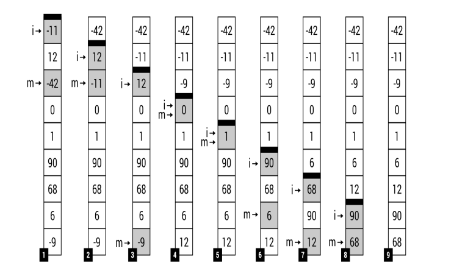

# About me

## Selection Sort 
Let's start with the selection sort, which is one of the
simplest sorting algorithms. The algorithm divides the array
into two parts, namely sorted and unsorted. In the following
iterations, the algorithm finds the smallest element in the
unsorted part and exchanges it with the first element in the
unsorted part.



At
the beginning (Step 1), the border is located just at the top of
the array, which means that the sorted part is empty. Thus, the
algorithm finds the smallest value in the unsorted part (-42)
and swaps it with the first element in this part (-11). The
result is shown in Step 2, where the sorted part contains one
element (-42), while the unsorted part consists of eight
elements. The afore mentioned steps are performed a few
times until only one element is left in the unsorted part. The
final result is shown in Step 9.

```C#
namespace TestProject
{
    public static class InsertionSort
    {
        //THis declare a static generic method (Swap <T>) that takes T[] array, int firstInex
        //and int MinIndex as parameters
        public static void Swap<T>(T[] array, int firstIndex, int MinIndex)
        {
            //Store the value in tempt and swap it with the second that swap the tempt with the
            //second, effectively swaping the value of first and second
            T temp = array[firstIndex];
            array[firstIndex] = array[MinIndex];
            array[MinIndex] = temp;
        }

        //This declare a static generic method (Sort <T>) which takes (T[] Array) as parameter
        // And all the <T> will be inherited from IComparable which is a system-bulit-in interface
        public static void Sort <T>(T[] Array) where T : IComparable
        {
            //The first loop will find the initial min value and index
            for (int FirstLoopIndex = 0;  FirstLoopIndex < Array.Length; FirstLoopIndex++)
            {
                //index is int but the value in the array can be Generic
                int minIndex = FirstLoopIndex;
                T minValue = Array[FirstLoopIndex];

                //The second loop will find the min value and index in the array
                //by comparing each value with the value of the initial min value
                for(int SecondLoopIndex = FirstLoopIndex + 1; SecondLoopIndex < Array.Length; SecondLoopIndex++)
                {
                    if (Array[SecondLoopIndex].CompareTo(minValue) < 0)
                    {
                        minIndex = SecondLoopIndex;
                        minValue = Array[SecondLoopIndex];
                    }
                }
                //After that it will swap the value of the real min index and the initial
                Swap(Array, FirstLoopIndex, minIndex);
            }
        }
    }
    class Program
    {
        static void Main(string[] args)
        {
            Console.Write("Enter the values separated by spaces: ");
            string input = Console.ReadLine();
            string[] values = input.Split(' ');

            int[] UnsortedArr = new int[values.Length];
            for (int i = 0; i < values.Length; i++)
            {
                UnsortedArr[i] = int.Parse(values[i]);
            }

            InsertionSort.Sort(UnsortedArr);
            Console.WriteLine(string.Join(" | ", UnsortedArr));
        }
    }

}
```